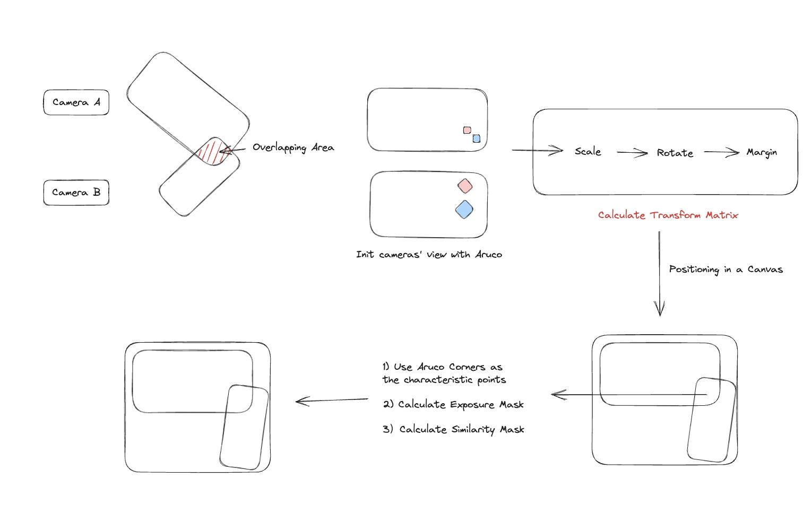
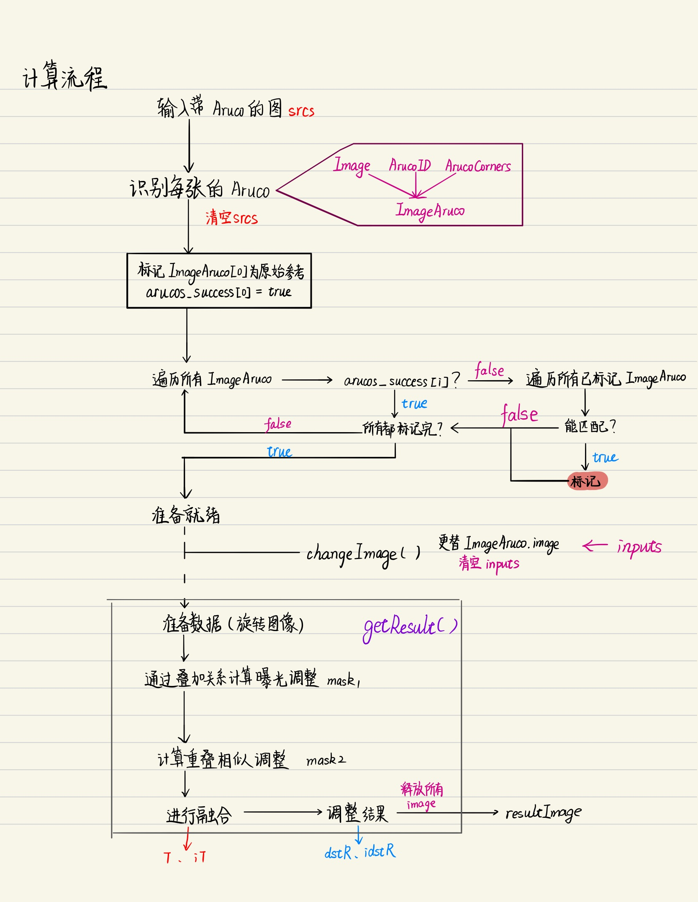
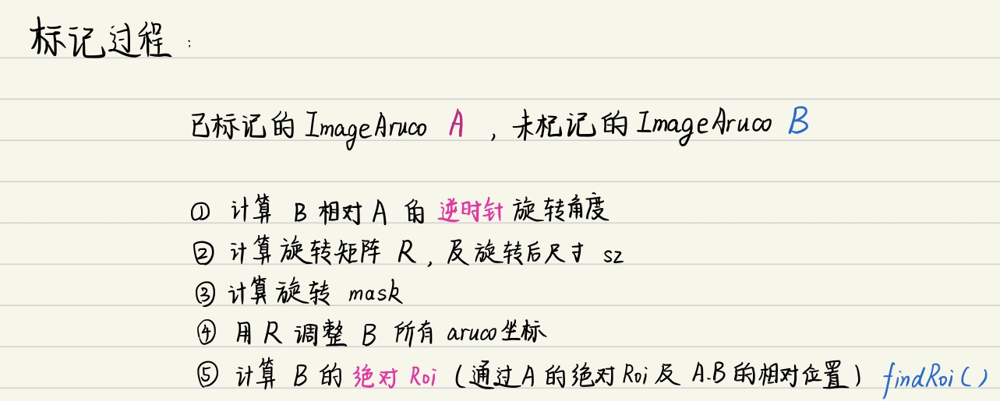
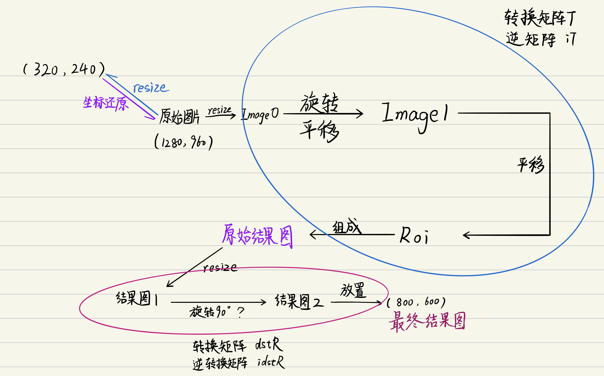
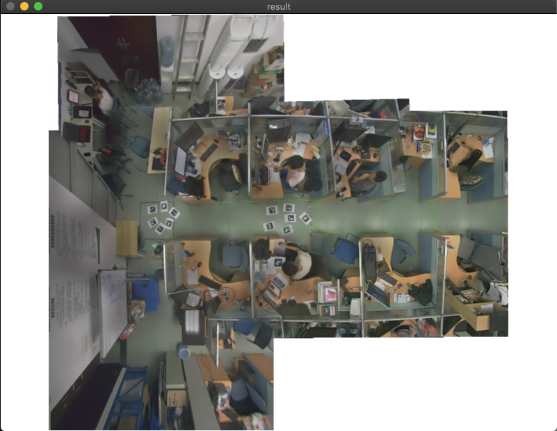
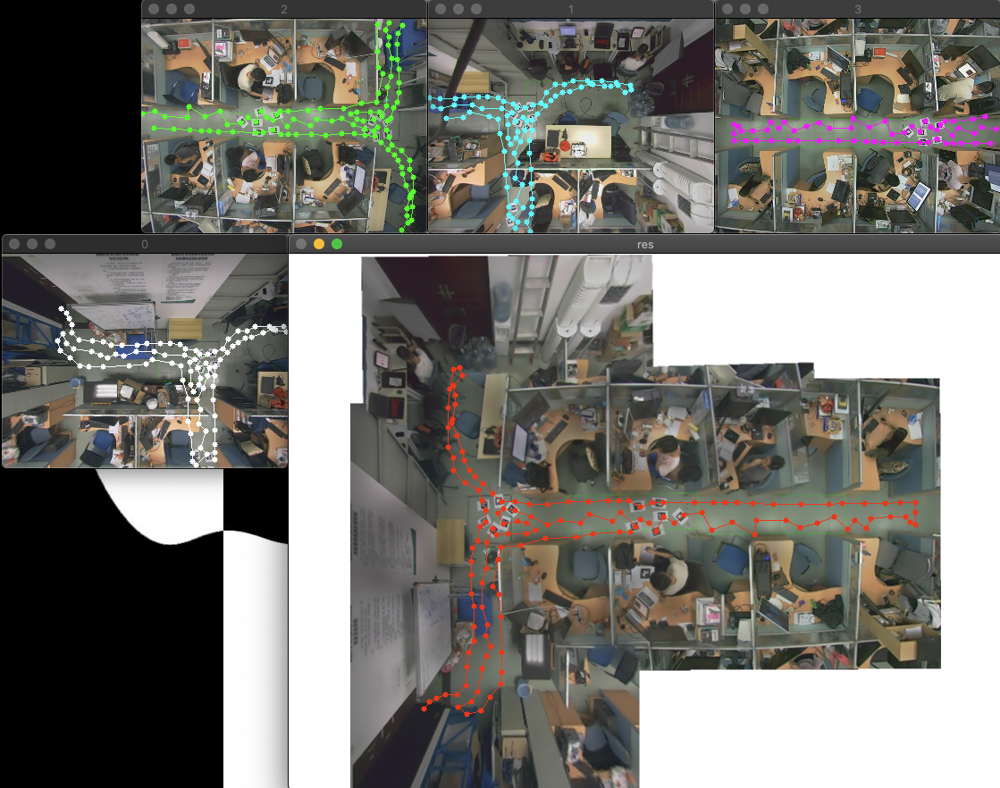
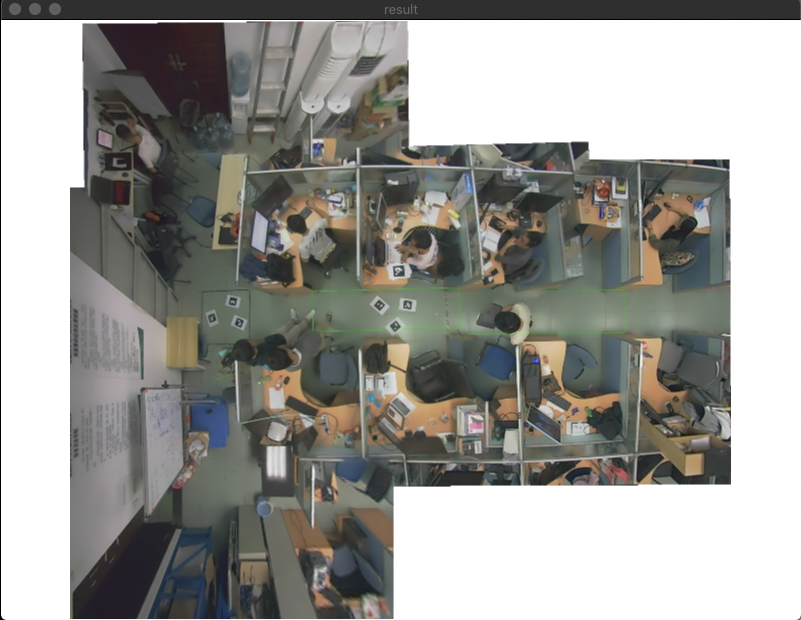

# Image Fusion With Aruco

A image funsion proposal for vertical cameras' view fusion and positioning, using in passenger tracking.

## 1 Requirements

1. OpenCV 4
2. OpenCV aruco模块
3. OpenCV stitching模块

## 2 Compiles

```
$ make
```

## 3 Usage

Run in MacOS

```
$ cd ./bin
$ ./main [mode] [input dir] [change dir]
```

### 3.1 Params Instruction

#### 3.1.1 mode

|mode  |说明  |
|---------|---------|
|DEBUG     |正变换         |
|IDEBUG     |反变换         |
|change     |测试换图片         |

#### 3.1.2 input dir

|input dir  |说明 |
|:---------:|:---------:|
|aruco3     |3张aruco初始化         |
|aruco4     |4张aruco初始化         |
|aruco5     |5张aruco初始化         |
|aruco6     |6张aruco初始化         |

#### 3.1.3 change dir

|change dir  |
|:---------:|
|aruco3  |
|aruco4  |
|aruco5  |
|aruco6  |
|xovis3  |
|xovis4  |
|xovis5  |
|xovis6  |

## 4 Algorithm Procedure



### 4.1 General Proceduate




### 4.2 Mark Procedure




### 4.3 Coordinate Tranformation



## 5 Results

### 5.1 Result 1: aruco6



### 5.2 Transformation（320，240） => （800，600）


### 5.3 Reverse Transformation（800，600） => （320，240）



### 5.4 Another set of Images' result  aruco6 => xovis3




