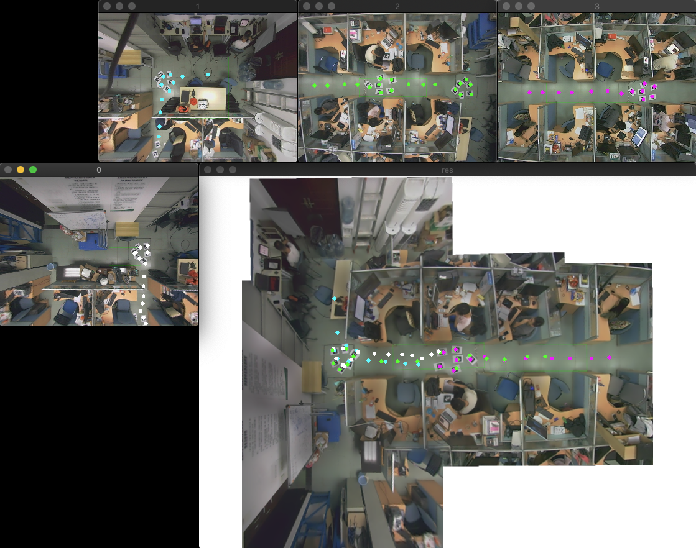

# Image Fusion With Aruco

## 环境要求

1. OpenCV 4
2. OpenCV aruco模块
3. OpenCV stitching模块

## 编译方法

```
$ make
```

## 使用用法

MacOS下直接运行

```
$ cd ./bin
$ ./main [mode] [input dir] [change dir]
```

### 参数说明

#### mode

|mode  |说明  |
|---------|---------|
|DEBUG     |正变换         |
|IDEBUG     |反变换         |
|change     |测试换图片         |

#### input dir

|input dir  |说明 |
|:---------:|:---------:|
|aruco3     |3张aruco初始化         |
|aruco4     |4张aruco初始化         |
|aruco5     |5张aruco初始化         |
|aruco6     |6张aruco初始化         |

#### change dir （mode = change时有效）

|change dir  |
|:---------:|
|aruco3  |
|aruco4  |
|aruco5  |
|aruco6  |
|xovis3  |
|xovis4  |
|xovis5  |
|xovis6  |


## 程序算法流程

### 整体流程


### 标记流程


### 坐标转换关系


## 运行展示

### 结果图 aruco6


### 正变换（320，240） => （800，600）



### 逆变换（800，600） => （320，240）


### 变更图像 aruco6 => xovis3


